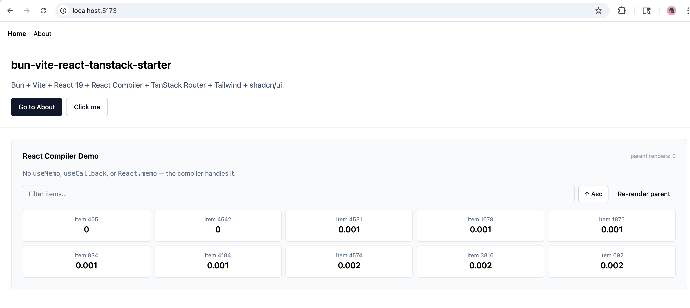

# react-compiler-vite-tanstack-starter



[](LICENSE)
[](https://react.dev)
[](https://vitejs.dev)
[](https://tanstack.com/router)
[](https://biomejs.dev)

**A minimal, ready-to-fork React 19 SPA starter with the React Compiler wired up and working — plus TanStack Router, Tailwind CSS v4, shadcn/ui, Biome, and Zod. Works with npm, pnpm, yarn, or bun.**

## Why this exists

Setting up the React Compiler with Vite, TanStack Router, and Tailwind v4 takes longer than it should — these tools are brand new and few examples show them working together. While building [SFDevTools](https://www.sfdevtools.com) I worked through all the wiring; this repo captures the result so you can skip straight to building.

## What it demonstrates

The included demo page (`src/App.tsx`) makes the React Compiler's automatic memoization visible without opening DevTools:

- **No `useMemo`** — an expensive filter + sort over 5 000 items is memoized by the compiler
- **No `useCallback`** — event handlers are stable across renders without manual wrapping
- **No `React.memo`** — child components skip re-renders automatically when their props haven't changed
- A **"Re-render parent"** button lets you verify child stability at runtime

Once you've seen it work, delete the demo and start building.

## Quickstart

```bash
# npm
npm install && npm run dev

# pnpm
pnpm install && pnpm dev

# yarn
yarn install && yarn dev

# bun (also supported)
bun install && bun dev
```

Default dev server: http://localhost:5173

```bash
npm run build
npm run check    # biome: format + lint (auto-fix)
npm run lint     # eslint: react-compiler rule only
```

## Stack

| Tool | Role |
|---|---|
| **Vite 7** | Dev server + bundler |
| **React 19** + React Compiler | UI + automatic memoization (no `useMemo` / `useCallback` / `React.memo`) |
| **TanStack Router** | File-based routing; route tree auto-generated at `src/routeTree.gen.ts` |
| **Tailwind CSS v4** | Utility CSS via `@tailwindcss/vite` — no `tailwind.config.js` |
| **shadcn/ui** | Copy-paste component primitives; `components.json` wired for the CLI |
| **Biome 2** | Formatting + general linting — replaces Prettier and most ESLint rules |
| **ESLint** | One rule only: `react-compiler/react-compiler` — no Biome equivalent |
| **Husky + lint-staged** | Pre-commit: Biome auto-fixes staged files → ESLint checks compiler rule |
| **Zod** | Runtime validation at env and API boundaries |

> **Bun:** This starter is fully Bun-compatible. `@types/bun` is included, `bun.lockb` / `bun.lock` are gitignored. Swap in `bun install` / `bunx` wherever you prefer.

## Pre-commit pipeline

```
git commit
  └─ lint-staged
       ├─ biome check --write   ← format + lint all staged *.{ts,tsx,js,jsx,json,css}
       └─ eslint                ← react-compiler rule on *.{ts,tsx}
```

## Adding a route

Drop a file under `src/routes/`. The router plugin regenerates `src/routeTree.gen.ts` on save.

```
src/routes/my-page.tsx   →   /my-page
```

## Adding shadcn primitives

```bash
npx shadcn@latest add card
npx shadcn@latest add input
```

Or copy components directly into `src/components/ui/`. The `cn()` helper is at `@/lib/utils`.

## Verifying the React Compiler ran

Search the production bundle for `react.memo_cache_sentinel`:

```bash
npm run build && grep -r "memo_cache_sentinel" dist/assets/
```

## Layout

```
src/
  routes/            # __root.tsx  index.tsx  about.tsx
  components/ui/     # button.tsx  (+ any added shadcn primitives)
  lib/utils.ts       # cn()
  styles/globals.css # tailwind v4 entry point
  routeTree.gen.ts   # generated — do not edit
  env.ts             # zod-validated import.meta.env
  router.tsx
  App.tsx            # RouterProvider + React Compiler demo
  main.tsx
```

## Related templates

- [salesforce-oauth-pkce-hono-bun](https://github.com/ShriPunta/salesforce-oauth-pkce-hono-bun) — Production-ready Salesforce OAuth 2.0 PKCE backend with Hono + Bun
- [salesforce-react-query-hooks](https://github.com/ShriPunta/salesforce-react-query-hooks) — TanStack Query v5 hooks for the Salesforce REST API

## License

MIT — Copyright (c) 2026 Shridhar Puntambekar.
